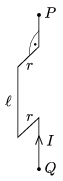

The piece of rigid wire, shown in the figure, and which can freely turn about the vertical axis of  PQ , is placed into uniform horizontal magnetic field. B =0.05 T, r =0.05 m, =0.3 m. A current of I =10 A flows in the wire and the mass of one metre-long wire is 10 dkg. What is the period of this piece of wire when it is oscillating with small amplitude?

 (5 pont)

