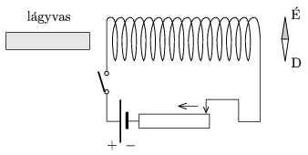

What happens to the compass placed as shown in the figure, if a ) the switch is
 turned on,
 b ) then keeping the switch on, the the wiper of the variable resistor is moved in the direction shown by the arrow.
 c ) then, still keeping the switch on, the bar of soft iron is pushed into the coil.
 d ) finally the switch is turned off.

 (4 pont)

