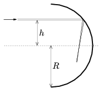

The inside of a half cylinder is silver-coated. The radius of the cylinder is R =6 cm. At a distance of h =4 cm from its symmetry axis there is a narrow beam of light. At what point does this beam of light focused?

 (5 pont)

