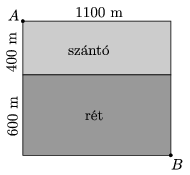

A tractor is used to transport hay bales from point  A to the stable denoted by  B as shown in the figure. The farmer has to be in a hurry in order to finish the transport before an approaching big thunderstorm. Find the best route for the tractor if the speed of the tractor on the arable land is 75% of its speed on the meadow. (Numerical solutions are also acceptable.)

 (4 pont)

