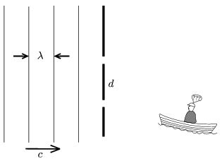

A man in a small dinghy approaches from a great distance the wave-breaker dam, in which there are two holes 8 m apart. Waves of wavelength =6 m hit the other side of the dam. What must the path of the dingy be if the man in it wants the dingy to be rocked the least?

 (4 pont)

