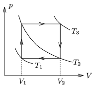

A sample of ideal gas is taken through the cyclic process shown in the figure.
 a ) What is the relation between T $_{1}$, T $_{2}$ and T $_{3}$?
 b ) Express the efficiency of the heat engine which carry out this cyclic process in terms of and .
 c ) In case of air between what values can this efficiency vary?

 (4 pont)

