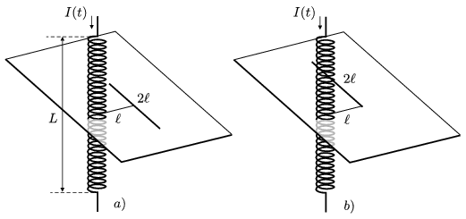

The number of turns of a solenoid (straight coil) of length L =0,5 m is N =2000, the area of its cross section is A =16 cm$^{2}$, and it has an iron core of relative permittivity of $_{r}$=2500. At a moment the current in the coil changes at a rate of 100 A/s. What is the induced voltage in that long straight wire of length 2 =20 cm (the wire is next to the centre of the coil)
 a ) which is perpendicular to the axis of the coil, if its two ends are equidistant from the coil, and its centre is at a distance of from the coil?
 b ) which has the same direction as the previous one, and one of its end is at a distance of from the axis of the coil?

 (5 pont)

