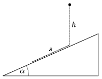

As the figure shows, a small object is dropped to a fixed, frictionless slope of angle of elevation =30$^\circ$ from a height  h . The time of the fall is t $_{1}$. After a totally inelastic collision the object slides down the slope. It covers the same distance s = h on the slope during the time  t $_{2}$. Determine the ratio of t $_{1}$/ t $_{2}$.

 (4 pont)

