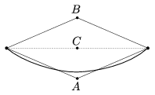

The two ends of a flexible rope of uniform density are fixed at the same height, as shown in the figure. Starting from the equilibrium position, we perform the following two experiments:
 I. We pull down the midpoint of the rope till it reaches point  A . (At this time the rope almost has a V-shape.)
 II. From the equilibrium position we pull up the midpoint of the rope to the point  B . (So now the shape of the rope is like an upside down V.)
 The total work we did in the two processes is  W . How much work is needed to lift the midpoint of the rope to the point  C ?

 (5 pont)

