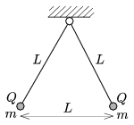

Two alike pendulums of length L are suspended at the same point. At the end of both pendulums there are small spheres of mass  m . If both spheres are given the same Q charge, the threads move apart as it is shown in the figure.
 a ) Determine the mass m of the spheres.
 b ) In another experiment the sphere on the right is changed to another one of the same charge, but three times bigger mass. How should the charge of the left sphere be changed, so that in equilibrium the distance between the two spheres remains  L ? (The mass of the left sphere is not changed.)

 (5 pont)

