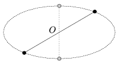

A group of amateur astronomers observes a newly discovered binary star. According to their observations the two stars look like a pair of bright points, whose path is the ellipse shown in the figure. Ester, the most enthusiastic member of the group, recently learned Kepler's laws in the high-school. According to her knowledge the celestial bodies really move along elliptical paths, but the attractive centre is not at the symmetry centre O of the ellipse but at one of its foci. She suspects that the two stars revolve about an invisible black hole, which has much greater mass than that of the stars, and which is at the focus of the ellipse. Can Ester be right? How would you explain the observation?

 (3 pont)

