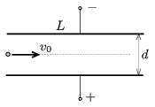

An electron is shot at an initial speed of v $_{0}$=4$^{.}$10$^{7}$ m/s into a parallel plate condenser halfway between the plates. The distance between the plates and the length of the plates are unknown, and a constant voltage of U =500 V is applied between the plates. If a uniform magnetic field of induction B =6.25$^{.}$10$^{-5}$ Vs/m$^{2}$ is also applied between the plates, in the appropriate direction, the electron goes through the plates without changing the direction of its motion, at a constant speed.
 a ) Determine the electric field between the plates of the parallel plate condenser.
 b ) Find the distance  d between the plates.
 c ) If the magnetic field is ceased the speed of the electron increase by 6% when passes the condenser. What is the length of the plates  L ?

 (4 pont)

