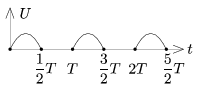
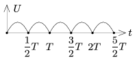

We have 4 alike, ideal diodes in order to rectify the sinusoidal voltage of the mains. The r.m.s. value of the mains is 230 V, and its frequency is 50 Hz. (Any number of diodes can be used up to 4.)
 a ) What circuit would you build in order to make a half-wave rectifier?

 b ) What circuit would you build in order to make a full-wave rectifier?

 c ) Determine the r.m.s. value of the voltage in both cases.
 (4 pont)

