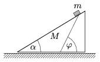

The wedge shown in the figure can slide without friction on a horizontal tabletop. The mass of the wedge is M and its angle of elevation is =30$^\circ$. A body of mass  m slides down without friction along the wedge, the path of the body makes an angle of =60$^\circ$ with the ground. Find the ratio of the masses, m / M .

 (5 pont)

