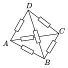

Using six different resistors the tetrahedron ABCD was soldered. If a battery is inserted between two vertices (for example A ,  B ) and a sensitive ammeter is inserted between other two vertices ( C ,  D ), then we experience with a surprise that the ammeter reads zero, independently of the two vertices of the tetrahedron which were chosen first.

 What is the relation between the six resistances?
 (4 pont)

