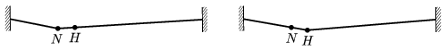

A thin, strong steel cable is stretched horizontally, with a great force, above a street. A rope dancer walks along the cable. When she covers one-fourth of the length of the cable, (she is at point  N ) the trisecting point of the cable ( H ) is 10 cm below its original position. What will the decent of the point N  be, when the rope dancer is at point  H ? (The mass of the cable is negligible, the deflection of the rope is very small with respect to the length of the cable, and the tension in the cable can be considered constant.)

 (5 pont)

