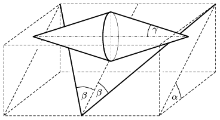

A double cone which ``rolls up'' on a slope is a well known playful experiment. The slope is made of two lathes. The angle between the inclined plane determined by the two lathes and the horizontal is  , and the angle between the steepest line along the inclined plane and a lath is  . What is the half vertex angle  of that double cone which can roll up on this slope?

 (5 pont)

