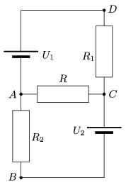

What is the resistance of the resistor  R shown in the figure if a ) there is no current in the branch  AB ; b ) the current in  AC is the greatest; c ) the potential difference between points  a and C is maximum; d ) the power at  R is maximum; e ) the current in branch  DC is maximum; f ) the current in AB is the maximum? ( Data: U $_{1}$=60 V, U $_{2}$=20 V, R $_{1}$=80  , R $_{2}$=320  .)

 (4 pont)

