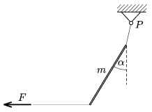

A skewer of mass m =1 g is hanged with a short thread attached to a fixed point  P . A long thread is attached to the bottom end of the skewer, and it is kept in equilibrium with a horizontal force. In this case the angle between the skewer and the vertical is  . a ) Find the angle between the short thread and the vertical. b ) Find the tension in the short thread, if =45$^\circ$.

 (4 pont)

