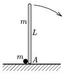

A thin, L =2 m long rod of mass m is standing vertically on a horizontal frictionless plane. Next to its bottom endpoint A there is a pointlike object of mass  m at rest. The rod fells out of its unstable equilibrium position, such that the paths of the small body and the rod are always in the same plane. What is the greatest speed of the small body?

 (6 pont)

