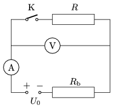

The electromotive force of the voltage supply in the circuit, shown in the figure, is U $_{0}$=9 V and its internal resistance R $_{b}$ is unknown. The resistances of the meters and the resistor are also unknown. When the switch is closed then the measured current increases to twice of the previous value, and the reading on the voltmeter decreases to half of the original value.
 a ) By what factor is the resistance of the voltmeter greater than that of the resistor?
 b ) What are the readings on the voltmeter before and after closing the switch?

 (4 pont)

