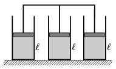

The three cylinders shown in the figure have the same cross section. In the cylinders there is the same type of ideal gas, and all the cylinders are closed with easily movable pistons of the same mass. The pistons are rigidly attached to each other. Initially the three samples of gas have the same density, the same temperature of t =27 $^\circ$C, and the same height of =20 cm.
 How much do the pistons rise if the temperature of the gas in the middle cylinder is increased to t '=117 $^\circ$C, while the temperature of the gas in the two bordering cylinders is kept constant?

 (4 pont)

