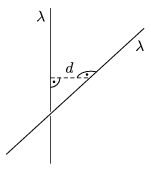

Two very long plastic rods are placed perpendicularly at a distance of  d . They are both charged uniformly, their linear charge density is  . Calculate the repelling force between them.

 (6 pont)

