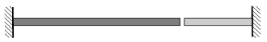

The figure shows two rods, a copper one and an aluminum one, which comes out of a wall. At a temperature of 20 $^\circ$C the length of the copper rod is 2 m, and the length of the aluminum one is 1 m. The gap between them is 1.3 mm.
 a ) At what temperature will the gap disappear?
 b ) What is the size of the gap at a temperature of 0 $^\circ$C?

 (4 pont)

