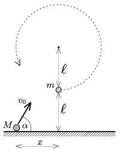

A small ball of mass m =0.1 kg is attached to a =1 m-long thread and is hung to a horizontal peg. The small ball is at rest and another small ball of mass M =0.2 kg, is projected from the ground and collides with it, such that the collision is totally elastic and head on, and after the collision the ball at the end of the thread completes a whole circle around the peg. The distance between the peg and the ground is 2 .
 a ) What is the least distance of  x shown in the figure?
 b ) What is the initial velocity of the projected ball? (Speed and direction.)

 (5 pont)

