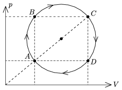

A sample of ideal gas of some mass is taken through the cyclic process shown in the figure. The temperature of the gas at state  A is T $_{ A }$=200 K, and at state  C is T $_{ C }$=1800 K.

 a ) By what factor is the pressure at state  B greater than at state  D ?
 b ) What temperature belongs to the isotherm which goes through the centre of the circle?
 c ) Prove with calculations that the temperatures at state  B and D are the same.
 (3 pont)

