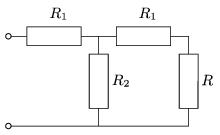

Given the resistances of the resistors R $_{1}$ and R $_{2}$. Choose the resistance of the resistor  R , such that the equivalent resistance of the circuit shown in the figure,
 a ) is also  R ;
 b ) is a given R $_{0}$ value. (What values can be given for  R $_{0}$?)

 (5 pont)

