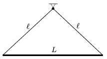

An iron rod of length  L is hung at a common point with threads of length  which are attached to the two ends of the rod. The rod is displaced a bit in the plane of the threads. What is the length of the threads if the period of the swinging of the rod is the least, and what is this period?

 (5 pont)

