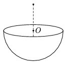

A hemispherical insulating shell is charged positively, and is fixed. The charge distribution on the shell is uniform. At a point on the symmetry axis, which is exactly at a distance of the radius measured from the centre of the hemisphere  O , a small negatively charged bead is released. The speed of the bead is v $_{0}$ when it reaches the centre  O .
 What will the speed of the bead be when it reaches the shell? (Neglect the effect of gravity.)

 (5 pont)

