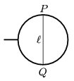

A soap film of surface tension is created in the frame, shown in the figure. The diameter of the frame is  . A piece of unstretched hair of length  , and of young modulus E  joins the points  P and  Q . By what amount will the hair be elongated if the film in the right hand side is pricked by a hot pin. (The two endpoints of the hair are fixed and its weight is negligible. For small angles use the approximation: sin  - $^{3}$/6.)

 (6 pont)

