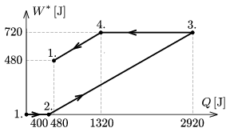

A sample of diatomic, ideal gas is taken through a cyclic process. The cyclic process can be composed of such open processes that the specific heat capacity of the gas during the certain processes does not change. The cyclic process is shown in the graph of the figure. The algebraic sum of the absorbed and delivered heat by the gas up to an instantaneous state, ( Q ), is shown on the horizontal axis, and the total amount of work done by the gas on its environment up to reaching the certain instantaneous state, ( W $^{*}$), is shown on the y  axis.

 a ) Using the graph, determine the efficiency of the cyclic process.
 b ) What types of processes build up the cyclic process? Reason your statements.
 c ) Let the pressure of the gas at state 1 be  p $_{0}$, and its volume be  V $_{0}$. Using these parameters plot the cyclic process on the p - V diagram.
 (5 pont)

