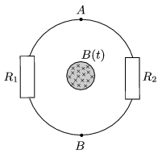

In a long thin iron rod uniformly changing magnetic induction can be created. The induced voltage in a wire around the rod is U =10 mV. A wire is put around the rod such that into one half of it a resistor of resistance R $_{1}$=10 k , and into the other half a resistor of resistance R $_{2}$=20 k are inserted.

 a ) What is the reading on the ideal voltmeter connected to the A and B terminals of the resistors?
 b ) What would be the reading on a voltmeter of resistance R $_{m}$=100 k ?
 Does the measured voltage depend on to which side of the rod the meter is placed?
 (5 pont)

