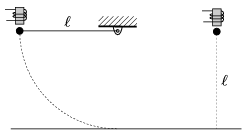

A one end of a thread of length  is tied to a small iron ball, whilst the other end is fixed at a height of  above a tabletop. The ball is displaced such that the thread is horizontal and is kept at this position by an electromagnet. At a height of  above the tabletop another small iron ball, similar to the one at the end of the thread, is also kept by an electromagnet. The two electromagnets release the balls at the same moment. The two balls begin to move at the same instant.
 Which one reaches the tabletop first?

 (4 pont)

