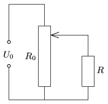

A resistor of resistance R =8  is operated with the aid of the variable resistor of resistance R $_{0}$=30  in the circuit shown in the figure. The e.m.f. of the voltage supply is U $_{0}$=24  V , and its internal resistance is negligible.
 a ) Where is the pointer of the variable resistor when the voltage across the resistor is 12 V?
 b ) In this case, what percentage of the total dissipated power is the power dissipated in the resistor?
 c ) Between what values can the dissipated power in the resistor be varied? Between what values can the power given off by the voltage supply vary?

 (4 pont)

