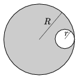

A circular piece of radius  r is cut out of a disc of radius R as shown in the figure. At what ratio of  r / R will the centre of mass of the remaining piece be closer to the centre of the disc than  R /100?

 (4 pont)

