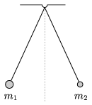

Two balls of masses m $_{1}$ and m $_{2}$ are hanged at the same point, with threads of equal lengths, and displaced towards the left and the right with the same angle measured from the vertical. They are both released at the same moment, and collide totally inelastically. The positions of the balls are described by their height above the horizontal plane which is through the lowest point of their paths. (Air resistance is negligible.) Give the ratio of the greatest height reached by the balls after the collision to the initial height.

 (4 pont)

