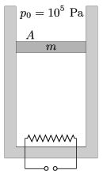

An easily moveable, insulated piston, of cross section A =2 dm$^{2}$ and of mass m =5 kg, confines some air in a vertical thermally insulated cylinder. The air is heated by a heating element of power 200 W.

 a ) What is the speed of the piston?
 b ) By what amount does the internal energy of the air change in 2 s?
 (5 pont)

