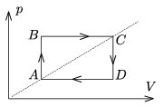

A sample of monatomic ideal gas is taken through the cyclic process shown in the figure. The temperature of the gas at state  A is T $_{ A }$=180 K. What is the temperature of the gas at state  C if the efficiency of the heat engine of this cyclic process is =2/9?

 (4 pont)

