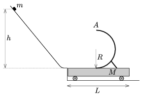

A small object of mass m slides along a slope which is attached tangentially to a cart of mass  M . In the middle of the cart a hemicylinder of radius  R is attached to the cart as shown in the figure. The small object of mass  m just reaches the top point  A of this hemicylinder, stops there for an instant, then it falls freely and just hits the rim of the car. a ) At least how long is the cart? b ) What is the mass of the cart? c ) From what height did the small object slide down? ( m =2 kg, R =0.6 m. Friction is negligible everywhere.)A small object of mass m slides along a slope which is attached tangentially to a cart of mass  M . In the middle of the cart a hemicylinder of radius  R is attached to the cart as shown in the figure. The small object of mass  m just reaches the top point  A of this hemicylinder, stops there for an instant, then it falls freely and just hits the rim of the car.
 a ) At least how long is the cart?
 b ) What is the mass of the cart?
 c ) From what height did the small object slide down?
 ( m =2 kg, R =0.6 m. Friction is negligible everywhere.)

 (6 pont)

