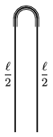

A fixed U shaped small narrow tube is turned upside-down and a thread of length is hanging in it as shown in the figure. Initially the length of the thread is /2 in each side. This is an unstable equilibrium since friction is negligibly small.

 a ) If the thread begins to slide to one side what will its speed be when it is straight?
 b ) What will the speed of the thread be when its momentary centre of mass is just at the same level as that end of the thread which is moving up?
 (4 pont)

