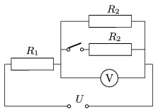

The values the resistance of the resistors connected to the voltage supply of U =120 V, as shown in the figure are unknown. When the switch is closed the reading on the voltmeter changes by 16 V, and the power dissipated by the resistor  R $_{1}$ changes by 51.2 W.

 a ) Using the condition given to the change in the voltage determine the ratio of the resistances: R $_{1}$/ R $_{2}$.
 b ) What are the values of the resistance of the resistors R $_{1}$ and  R $_{2}$?
 (4 pont)

