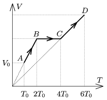

A sample of monatomic ideal gas is taken through the process shown in the V - T diagram of the figure. At state  A the pressure of the gas is  p $_{0}$, its volume is V $_{0}$ and its temperature is T $_{0}$=200 K.

 a ) Draw the graph of the process on the p - V diagram.
 b ) Find that state  E of the process on the p - V diagram for which it is true that the works done by the gas during the processes A E and E D are equal.
 c ) What is the temperature of the gas at state  E ?
 d ) By what factor the absorbed heat in process A E is greater than that of in process E D ?
 (4 pont)

