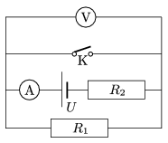

The readings on the voltmeter and the ammeter connected to the circuit shown in the figure are 10 V and 200 mA, respectively when the switch is open. If the switch is closed the reading on the ammeter increases by 0.1 A, and the voltage across resistor R $_{2}$ increases by 10 V.

 a ) What are the resistance values of the resistors?
 b ) What is the voltage of the voltage supply? c ) What is the reading on the voltmeter when the switch is closed?
 (4 pont)

