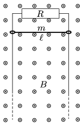

The opposite sides of the vertical conducting frame shown in the figure are parallel, and the top part is connected through a resistor of resistance R =2 ohm. The frame is in uniform magnetic field of B which is perpendicular to the plane of the frame. B =0.8 T. The distance between the parallel, vertical sides of the frame is =20 cm, and the mass of the piece of conductor of negligible resistance, which can slide along the vertical wires without friction is m =200 g. The piece of conductor is released with zero initial speed.

 a ) Graph the net force exerted on the piece of conductor as a function of the speed of the conductor.
 b ) Estimate how much time elapses while the speed of the conductor changes from 4 m/s to 4.2 m/s. How much distance does it cover during this?
 (5 pont)

