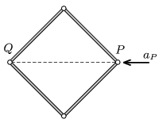

Four similar rods of uniform density are connected with frictionless hinges, and this frame is placed to a horizontal smooth tabletop, such that its shape is a square. Vertex  P is acted upon by a horizontal force in the direction of the diagonal, and due to this force it begins to move at an acceleration of  a $_{ P }$. What is the acceleration of the opposite vertex  Q at which it begins to move?

 (6 pont)

