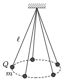

Five alike =0.5 metre long pendulums are made of electrically insulating threads and of small metal spheres of mass m =50 milligram. Each small sphere is given the same type of electrical charge of Q =10$^{-7}$ coulomb, and the pendulums are hung at the same point. Reaching the equilibrium position, because the mutual repulsion the small spheres will be on the circumference of a horizontal circle.
 a ) What is the radius of this circle?
 b ) What would the number of revolution of the rotation of the pendulums be, if they were to rotate about a vertical axis going through the point at which they are hung, and the small spheres were to move along the circumference of the above described circle such that the spheres had no charge on them?

 (5 pont)

