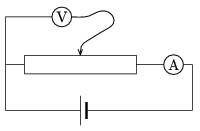

The pointer of the linear variable resistor (rheostat), shown in the figure is initially at the middle of the rheostat. How do the readings on the meters change if the pointer is slowly moved towards the right? The resistance of the variable resistor is R and the internal resistance values of the voltmeter and the ammeter are R $_{ V }$ and  R $_{ A }$, respectively.

 (5 pont)

