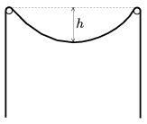

An unexpansible, flexible heavy rope is hung to two nails, held at the same height as shown in the figure. The rope is at rest in this position. The length of the rope between the nails is and the deepest point of this part of the hanging rope is at a depth of  h , measured from the level of the nails. How long is the rope? (Friction is negligible.)

 (6 pont)

