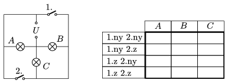

The bulbs connected as shown in the figure are alike, their power-rating is P when the voltage across them is  U . What are the values of the voltage and the power across them, in case of open (ny) and closed (z) switches? Fill in the table.

 (4 pont)

