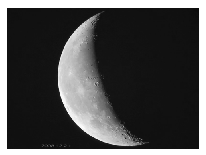

The attached photograph (which can also be seen in the first cover of this journal) shows a phase of the descending Moon. Using the sizes of the figure determine how many days before the picture was taken was a full Moon.

 (4 pont)

